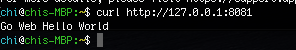

# Build the App And Expose the Service to 8081 Port
Since we have created a sample hello world web app and pushed it to gitlab, now we can use this session to introdue you how to build this app and expose the service to 8081 port.
## Steps
- Enter the go-web-hello-world directory we created in the previous session.
- Run the helloWorld.go:
```
$  go run .
```
- Note, I got 'go run: no go files listed' error for this command.
- I checked the go version by:
```
$ go version
```
and I got 
```
go version go1.6.2 linux/amd64
```
- I realized I should get a higher version to run the app.
- I referred to [here](https://golang.org/doc/install) to reinstall go program. 
- I met multiple problems here even by following the above official website.
  - ```sudo rm -rf /usr/local/go && tar -C /usr/local -xzf go1.16.2.linux-amd64.tar.gz```
     - Problem: I got multiple permission denied even though I added sudo before the command.
     - Solution: add another sudo, which will be ```sudo rm -rf /usr/local/go && sudo tar -C /usr/local -xzf go1.16.2.linux-amd64.tar.gz```
     - Reason: The very first sudo only works for the first command, which is ``` rm -rf /usr/local/go ```
  - ``` export PATH=$PATH:/usr/local/go/bin ```
     - Problem: go version didn't get updated even though I followed the note which is to run the shell commands directly or execute them from the profile using a command: source $HOME/.profile.
     - Solution: 
       - ``` $ sudo rm -rf /usr/local/go ```
       - ``` $ sudo tar -C /usr/local -xzf go1.16.2.linux-amd64.tar.gz ```
       - ``` $ go version ```
       - ``` -bash: /usr/bin/go: No such file or directory ```
       - ``` $ cd /usr/local/go/ ```
       - ``` $ ls ```
       - ``` api      CONTRIBUTING.md  favicon.ico  misc     README.md    src ```
       - ``` AUTHORS  CONTRIBUTORS     lib          PATENTS  robots.txt   test ```
       - ``` bin      doc              LICENSE      pkg      SECURITY.md  VERSION ```
       - ``` $ cd bin/ ```
       - ``` $ ls ```
       - ```go  gofmt ```
       - ``` $ sudo mv go /usr/bin ```
       - ``` $ go version ```
       - ``` go version go1.16.2 linux/amd64 ```
    - Reason: there is an existing old go binary in the /usr/bin directory. I have to remove it and put the new one in the directory. 
- Enable dependency tracking for your code.
``` 
$ go mod init example.com/helloWorld
```
- Run the code 
```
$ go run .
```
- open another terminal, and issue command 
```
curl http://127.0.0.1:8081
```
- You should be able to see the expected output now.
- 


