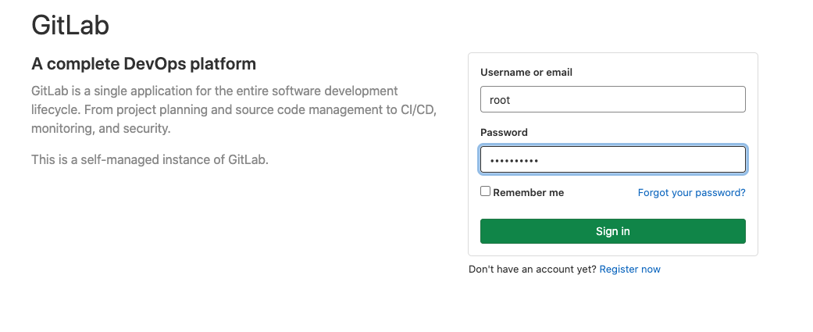
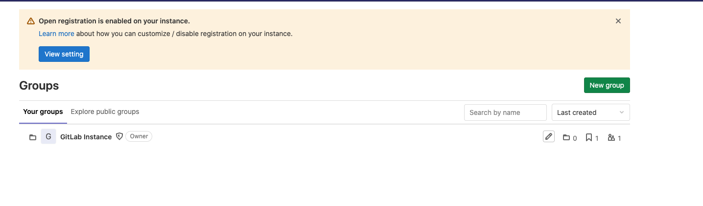
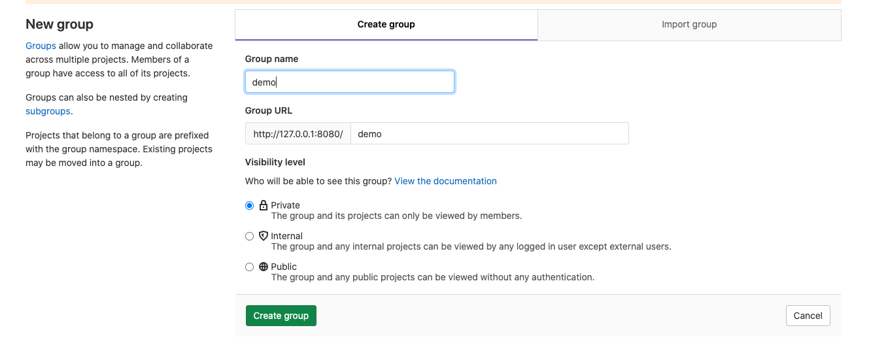
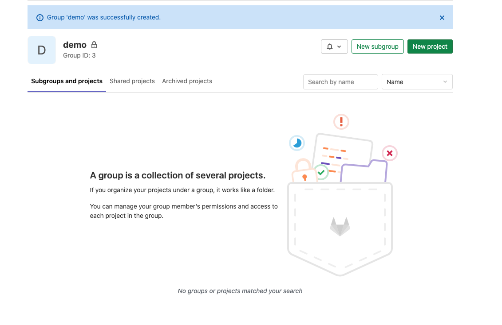
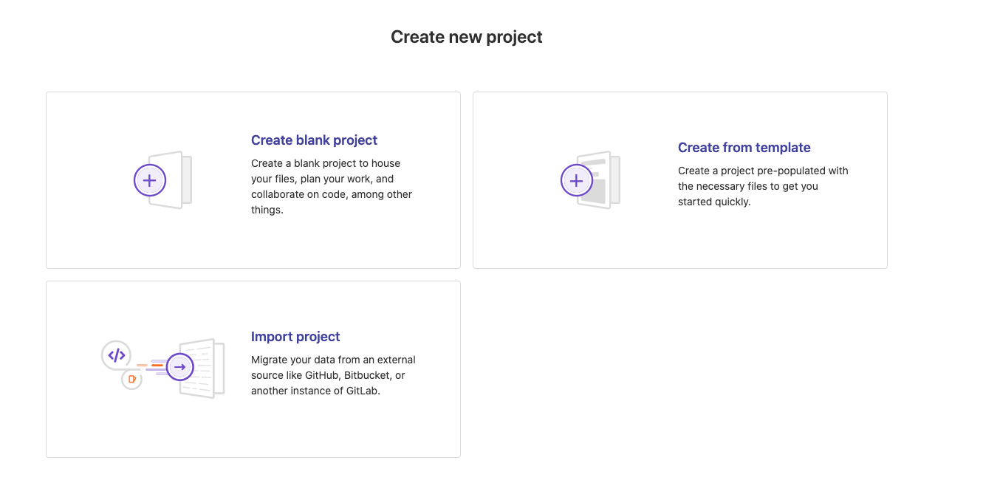
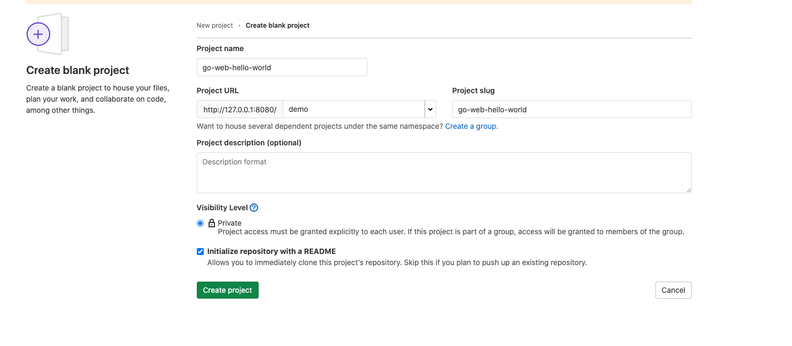
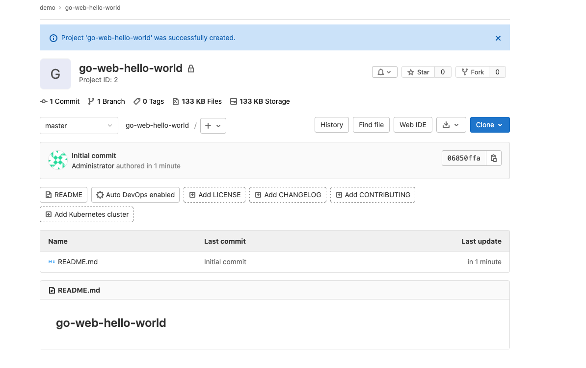
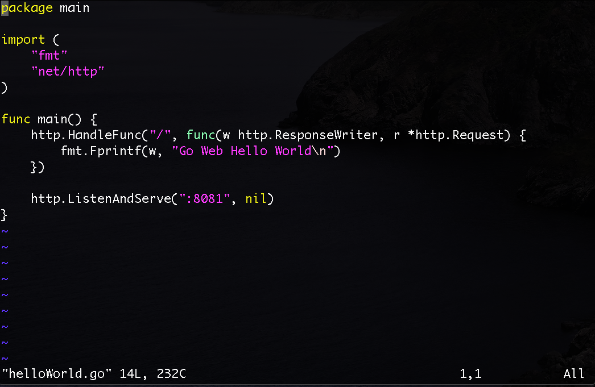
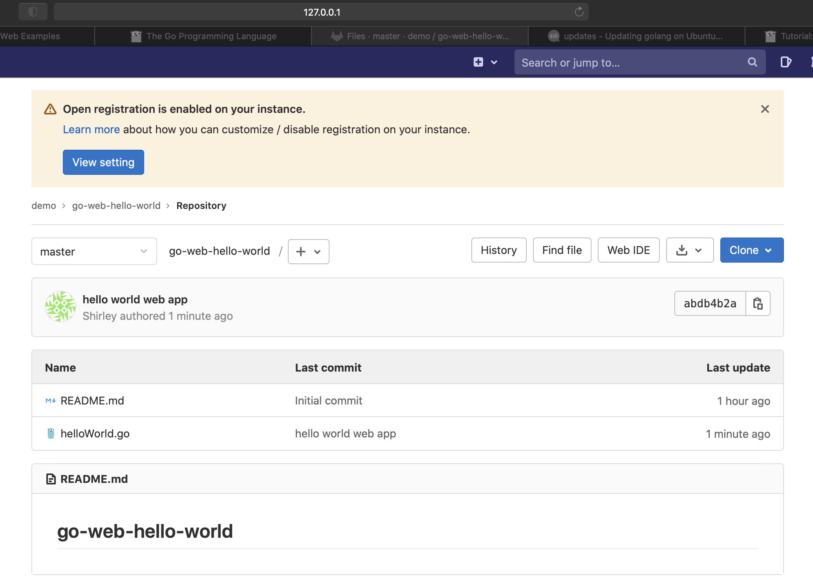

# Create a Demo Group/project in gitlab
This session will introduce you how to create a demo group/project in gitlab. I will use demo/go-web-hello-world (demo is group name, go-web-hello-world is project name) and then use golang to build a hello world web app (listen to 8081 port) as an example.
## Steps
### Create a Project
- Go to [Gitlab](http://127.0.0.1:8080) to finish the signup/signin process. It should be very simple and straightforward.

- Click 'New Group' button on the Groups page

- Define the name as 'demo' here. I choose to set this group as ’Private‘ but you can also use the other visibility levels. Hit 'Create Group' button.

- Click 'New Project' button on this demo page

- Choose 'Create blank project'

- Define the project name as 'go-web-hello-world' here. Still set it as 'Private' and hit 'Create project'.

- Go back to the main page and you will see the demo/go-web-hello-world is there.

### Use golang to Build a Hello World Web App
- Clone the project from gitlab to local by:
```
$ git clone http://127.0.0.1/demo/go-web-hello-world.git
```
- Enter the project directory:
```
$ cd go-web-hello-world/
```
- Check if there is a go program installed
```
$ go
```
- There is a large possibility that you don't have a go program installed there like me, so use the below command to install it
```
$ sudo apt install golang-go
```
- Create a helloWorld.go as the web app(listen to 8081 port) under this directory. You can refer to [here](https://gowebexamples.com/hello-world/) to create a simple hello world app by using golang.
```
$ vi helloWorld.go
```
- Here is the sample code that I created:

### Check in the Code to Gitlab
- Check in this helloWorld.go to Gitlab mainline.
```
$ git status
$ git add .
$ git branch
$ git commit -m "hello world web app"
$ git push
```
- Expect source code at http://127.0.0.1:8080/demo/go-web-hello-world


