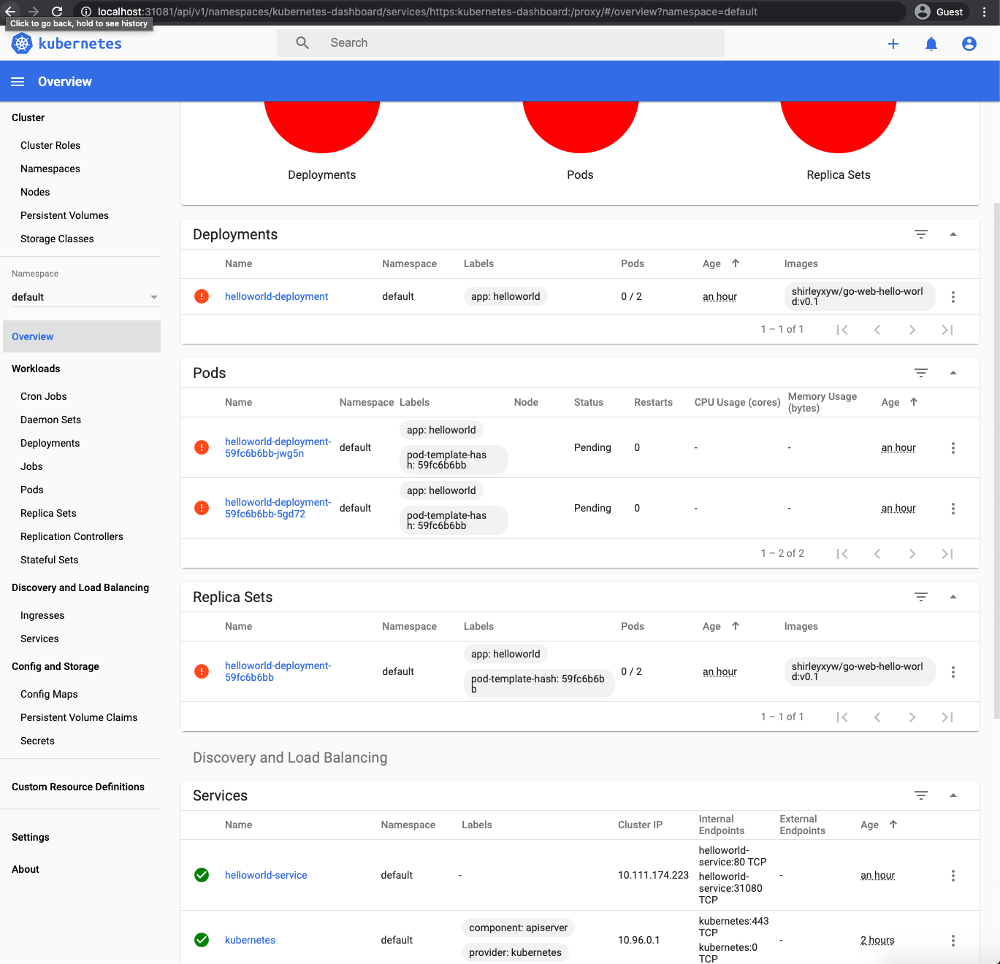

# Generate Token for Dashboard Login in
In the previous session, we were at the point that dashboard is asking for a token to login. So in this session, I will introduce how to generate a token.
## Steps
- Refer to [here](https://docs.giantswarm.io/app-platform/apps/kubernetes-dashboard/)
- Create a service account first by running:
```
kubectl create serviceaccount dashboard -n default
```
```
kubectl create clusterrolebinding dashboard-admin -n default --clusterrole=cluster-admin --serviceaccount=default:dashboard
```
- Generate token by running 
```
kubectl get secret $(kubectl get serviceaccount dashboard -o jsonpath="{.secrets[0].name}") -o jsonpath="{.data.token}" | base64 --decode
```
- Copy the token from the terminal output and then use the token to login to your dashboard
- You will see the dashboard like below:

