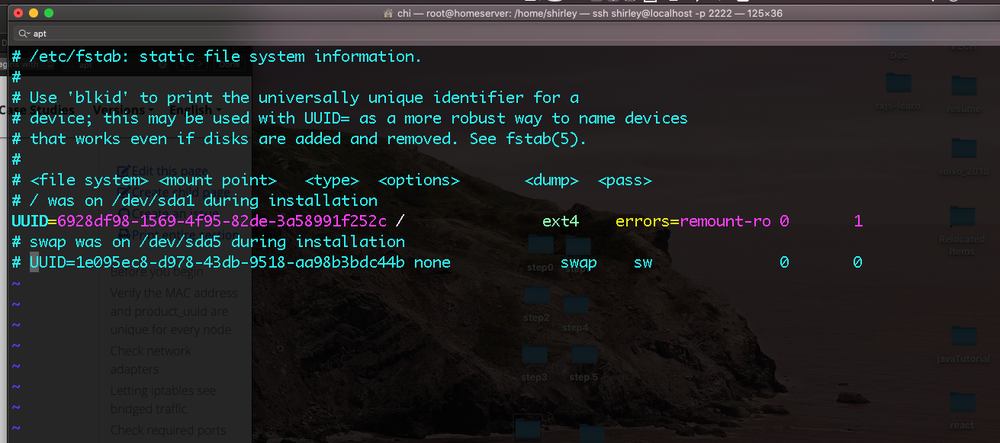
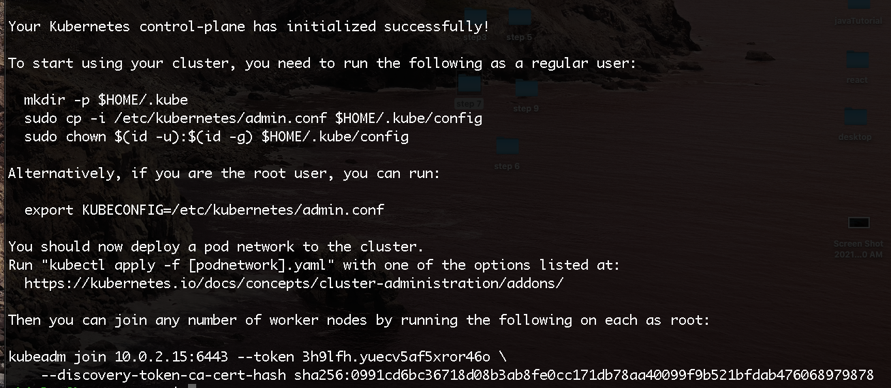
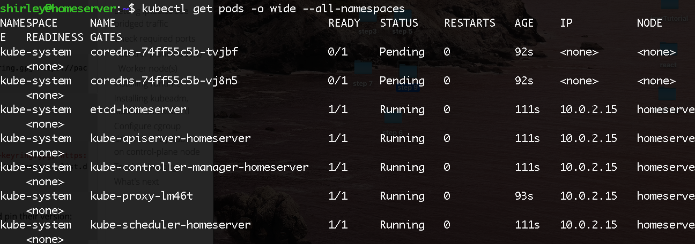

# Install a Single Node Cluster
This session will guide to install a single node Kubernetes cluster using kubeadm.
## Steps
I followed [here](https://kubernetes.io/docs/setup/independent/create-cluster-kubeadm/) to browse the whole installation process but I simplified this long process to below few command based on my needs here, which is install a single node cluster.
- First, login as ‘sudo’ user because the following set of commands need to be executed with ‘sudo’ permissions. 
```
$ sudo su
```
- Then, update your ‘apt-get’ repository.
```
# apt-get update
```
- Turn off swap space because Kubernetes will start throwing random errors otherwise. After that you need to open the ‘fstab’ file and comment out the line which has mention of swap partition.
```
# swapoff -a
# vi /etc/fstab
```
- The /etc/fstab should be like below now:

- Update the apt package index and install packages needed to use the Kubernetes apt repository:
```
sudo apt-get update
sudo apt-get install -y apt-transport-https ca-certificates curl
```
- Download the Google Cloud public signing key:
```
sudo curl -fsSLo /usr/share/keyrings/kubernetes-archive-keyring.gpg https://packages.cloud.google.com/apt/doc/apt-key.gpg
```
- Add the Kubernetes apt repository:
```
echo "deb [signed-by=/usr/share/keyrings/kubernetes-archive-keyring.gpg] https://apt.kubernetes.io/ kubernetes-xenial main" | sudo tee /etc/apt/sources.list.d/kubernetes.list
```
- Update apt package index, install kubelet, kubeadm and kubectl, and pin their version:
```
sudo apt-get update
sudo apt-get install -y kubelet kubeadm kubectl
sudo apt-mark hold kubelet kubeadm kubectl
```
### Steps For Kubernetes Master VM
- We will now start our Kubernetes cluster from the master’s machine. Run the following command:
```
$ sudo kubeadm init --apiserver-advertise-address=10.0.2.15 --pod-network-cidr=10.0.0.0/16
```
- You will need to run ``` ifconfig``` to check the ip address used above
- After the execution you get some message printed as below:

- Follow the message by running commands:
```
mkdir -p $HOME/.kube
sudo cp -i /etc/kubernetes/admin.conf $HOME/.kube/config
sudo chown $(id -u):$(id -g) $HOME/.kube/config
```
- To verify, if kubectl is working or not, run the following command:
```
$ kubectl get pods -o wide --all-namespaces
```
- And you should get something like

### Check-in admin.conf file into the gitlab repo
Just use the normal git check-in process and commands to check-in this file to gitlab repo.
