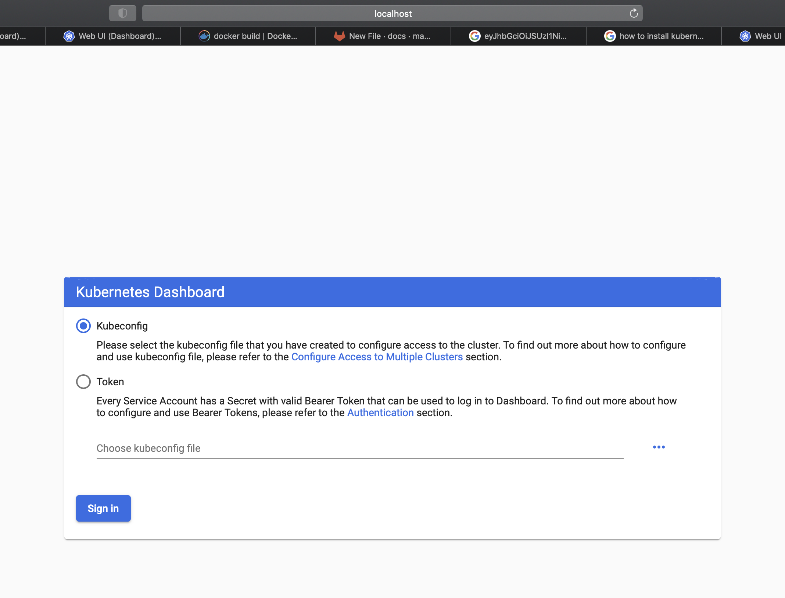

# Install Kubernetes Dashboard
This session will guide you through how to install the Kubernetes Dashboard.
## Steps
### Install Calico
- To be able to use the Dashboard, I downloaded Calico to provide both networking and network policy for self-managed on-premises deployments.
- You can refer to [here](https://docs.projectcalico.org/getting-started/kubernetes/self-managed-onprem/onpremises)
- I ran the below commands to install Calico
  - Download the Calico networking manifest for the Kubernetes API datastore.
     - ``` curl https://docs.projectcalico.org/manifests/calico.yaml -O ```
  - Customize the manifest as necessary and then apply the manifest using the following command
     - ``` kubectl apply -f calico.yaml ```     
### Install Kubernetes Dashboard
- Refer [here](https://kubernetes.io/docs/tasks/access-application-cluster/web-ui-dashboard/) for more detailed information to install Kubernetes dashboard
- The Dashboard UI is not deployed by default. To deploy it, run the following command:
```
kubectl apply -f https://raw.githubusercontent.com/kubernetes/dashboard/v2.0.0/aio/deploy/recommended.yaml
```
- You can access Dashboard using the kubectl command-line tool by running the following command:
```
kubectl proxy --address='0.0.0.0' --disable-filter=true

kubectl proxy --address='0.0.0.0' -p 31081
```
- You should be able to see the login page [here](http://localhost:31081/api/v1/namespaces/kubernetes-dashboard/services/https:kubernetes-dashboard:/proxy/#/login)

