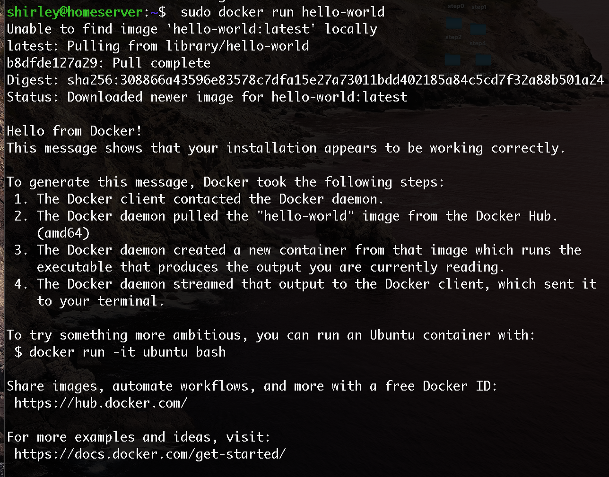

# Install Docker
This session will guide you to install Docker.
## Steps
- I refer to [here](https://docs.docker.com/install/linux/docker-ce/ubuntu/) to execute the below commands:
- Uninstall old versions
```
$ sudo apt-get remove docker docker-engine docker.io containerd runc
```
- Update the apt package index and install packages:
```
$ sudo apt-get update

$ sudo apt-get install \
    apt-transport-https \
    ca-certificates \
    curl \
    gnupg \
    lsb-release
```
- Add Docker’s official GPG key:
```
$ curl -fsSL https://download.docker.com/linux/ubuntu/gpg | sudo gpg --dearmor -o /usr/share/keyrings/docker-archive-keyring.gpg
```
- Set up the stable repository.
```
$ echo \
  "deb [arch=amd64 signed-by=/usr/share/keyrings/docker-archive-keyring.gpg] https://download.docker.com/linux/ubuntu \
  $(lsb_release -cs) stable" | sudo tee /etc/apt/sources.list.d/docker.list > /dev/null
```
- Update the apt package index, and install the latest version of Docker Engine and containerd
```
 $ sudo apt-get update
 $ sudo apt-get install docker-ce docker-ce-cli containerd.io
```
- Downloads a test image and runs it in a container.
```
$ sudo docker run hello-world
```
- You should able to see the information printed:


