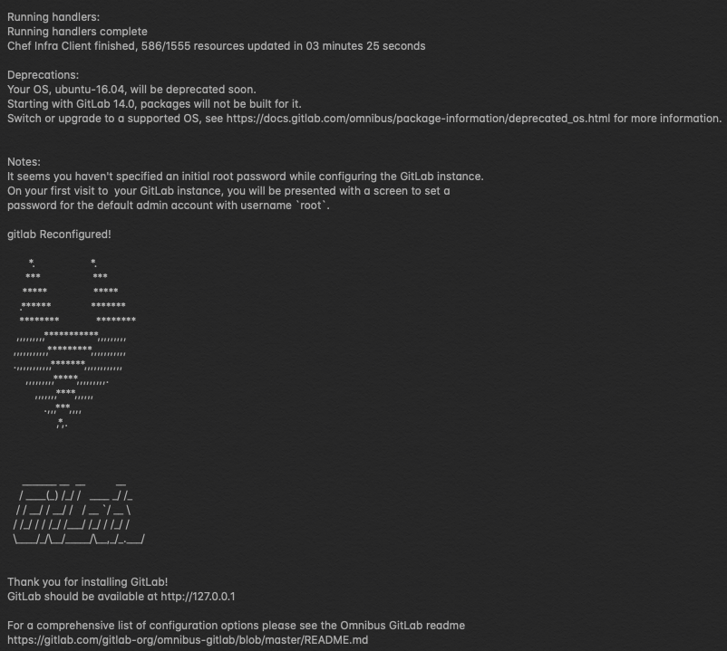

# Install Gitlab-ce
This session will guide you to install the Gitlab-ce version on the host.
## Steps
- Please refer to [here](https://about.gitlab.com/install/#ubuntu?version=ce) for detailed explaination of each command.
- Install and configure the necessary dependencies by running 
```
$ sudo apt-get install -y curl openssh-server ca-certificates tzdata perl
```
- Add the GitLab package repository by running
```
$ curl -sS https://packages.gitlab.com/install/repositories/gitlab/gitlab-ce/script.deb.sh | sudo bash
```
- Next, install the GitLab package
```
$ sudo EXTERNAL_URL="127.0.0.1" apt-get install gitlab-ce
```
- You should see this screen if the installation is done.
- 
- You can check your output by accessing it from host machine http://127.0.0.1:8080


