# Install Server and Forward Port 
This session will introduce how to install a Ubuntu server on a Virtual Machine and then forword multiple ports to host machine.
## Prerequisite
- Please make sure the virtual machine is installed and setup well.
- Reference to install a virtual machine can be found [here](https://www.virtualbox.org/). You can install other virtual machines based on your needs but I will use VM VirtualBox here as an example.
- Local machine is also fine but I will use a virtual machine here as an example.
## Steps
### Create Virtual Machine
- Please download Ubuntu 16.04 image [here](http://releases.ubuntu.com/16.04/ubuntu-16.04.7-server-amd64.iso) to your local machine.
- More other versions of images can be found [here](http://releases.ubuntu.com/16.04/). You can choose your favorite image according to your actual situation but I will use the 16.04 server 64-bit here as an example.
- Open VM VirtualBox Manager installed on your local machine.
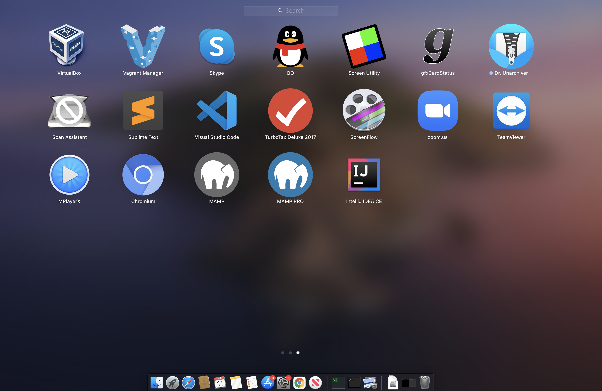
- Click 'New' button to open a dialog.
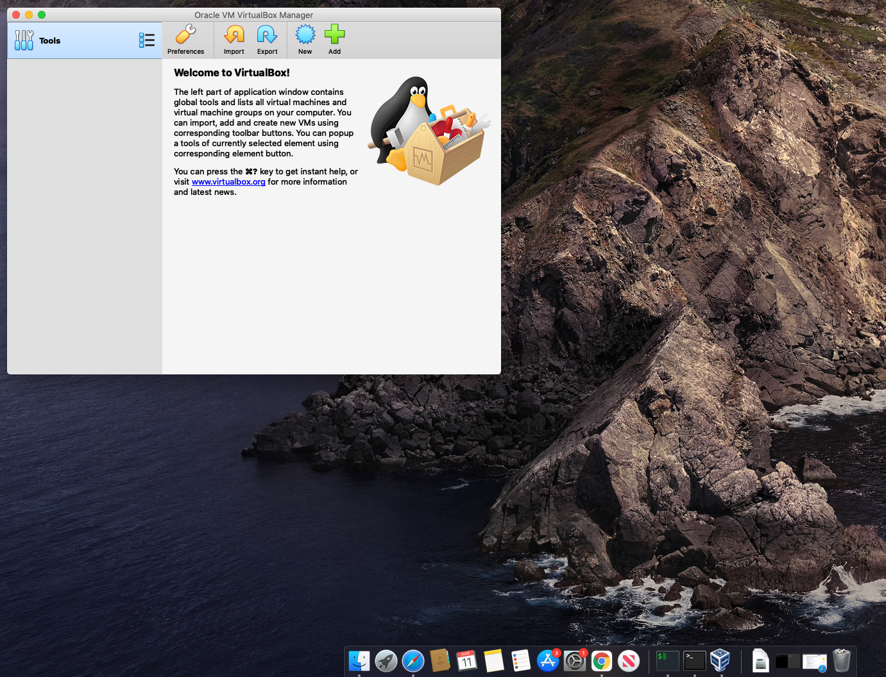
- Type a name for the new virtual machine. Since I am planning to install Ubuntu 16.04, I'll use 'ubuntu1604' as a name here. VirtualBox will automatically changes 'Type' to Linux and 'Version' to 'Ubuntu (64 bit)'. These two options are exactly what we need.
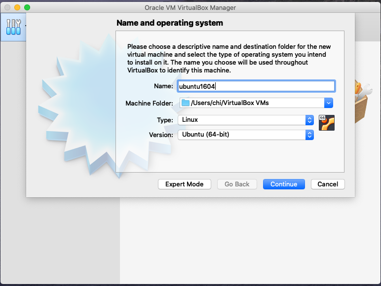
- Set the memory size, hard drive type, storage, file location and size based on your needs and hit 'Create' button and VirtualBox will generate a new Ubuntu virtual machine.
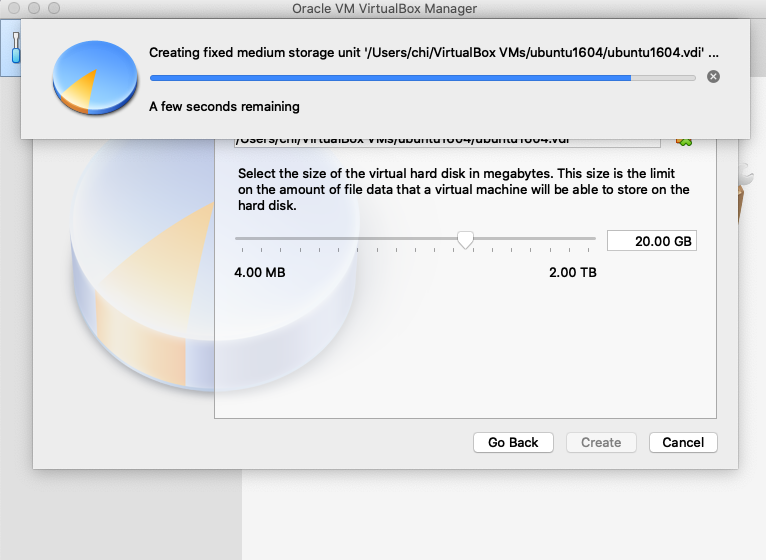
- Now the virtual machine is created. We are ready to install Ubuntu in this virtual machine. 
- Select your new virtual machine and click 'Settings' button. Click on 'Storage' category and then 'Empty' under Controller:IDE. Click "CD/DVD" icon on right hand side and select the ubuntu ISO file to mount.
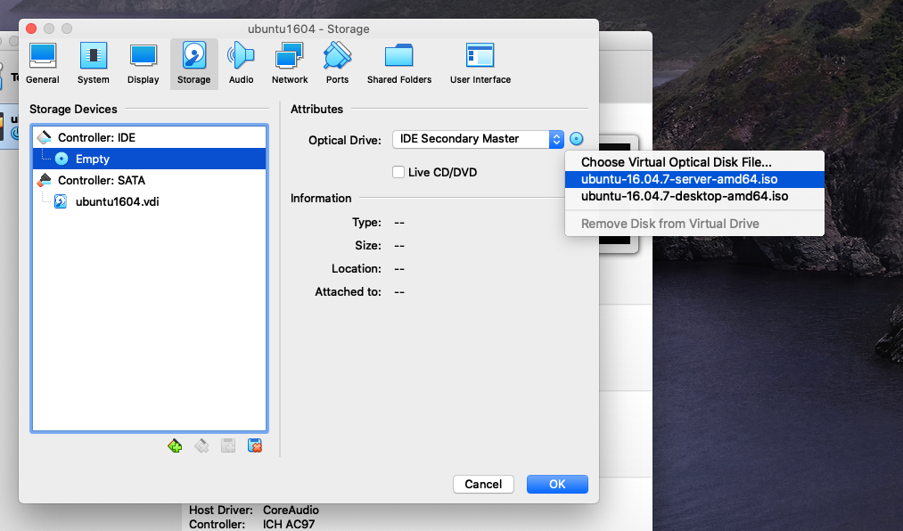
- Click on 'System' category and then click the Processor tab to set the CPU number. It is a good idea to specify a large number of processors in virtual machine (default value is 1). In this case, I change the number of CPUs to 4 since 4 is the largest value shown on the green bar in my case. Now you can click 'OK' button to continue.
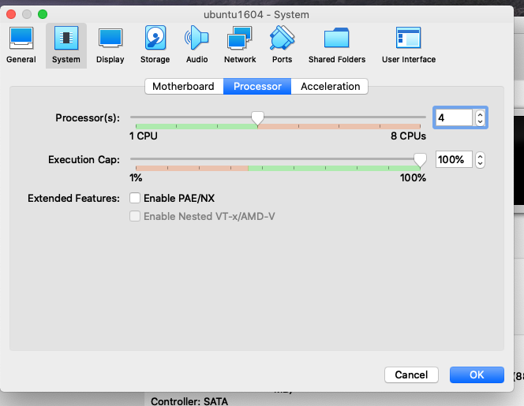
- You can also change the base memory number under the Motherboard tab. In this case, I use 4096(default value is 2014). And then hit 'OK' button.
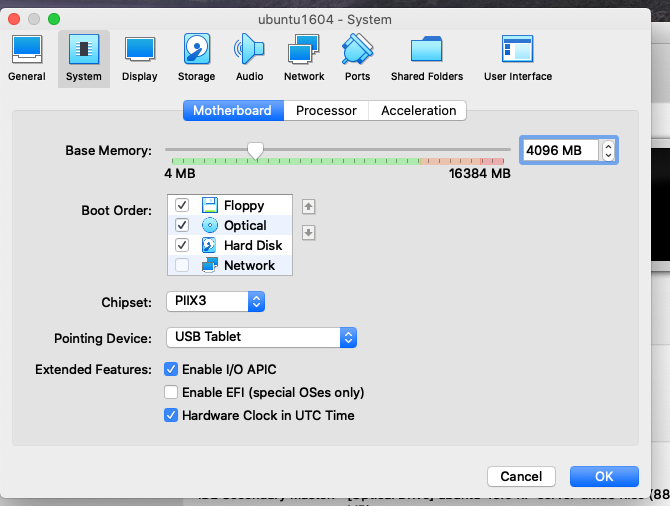
### Install Ubuntu
- Back to VM VirtualBox Manager, click on the new Ubuntu virtual machine and hit 'Start' button. You should able to see a 'Welcome' page on your virtual machine. Click 'Install Ubuntu' button. 
- 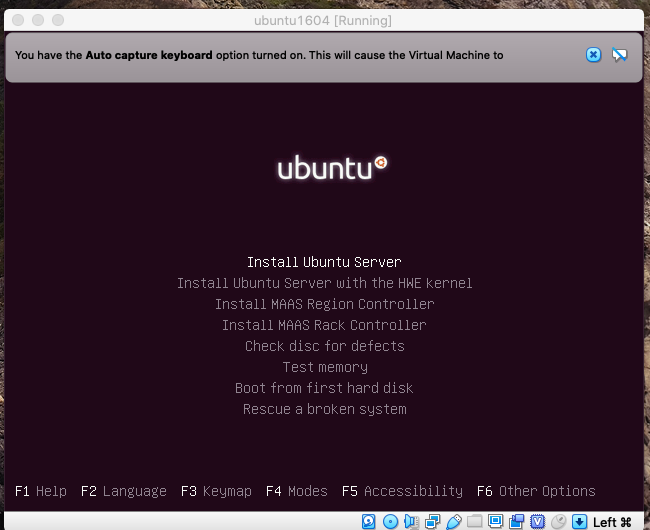
- The installation process is straightforward. Just follow each screen to set up the location, language, time zone, hostname and other basic infomration.
- I just put one screenshot here I believe the most important. Select you desired softwares here to install. 
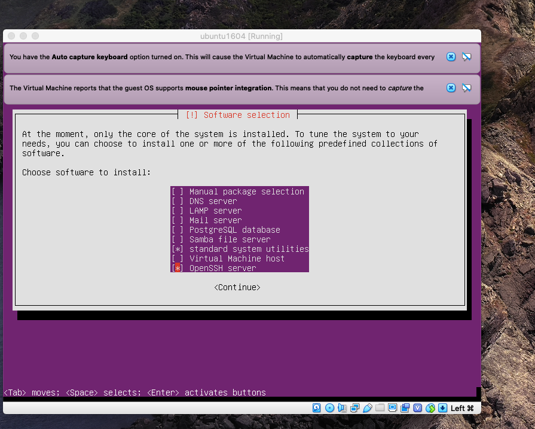
- Finish the installation.
- 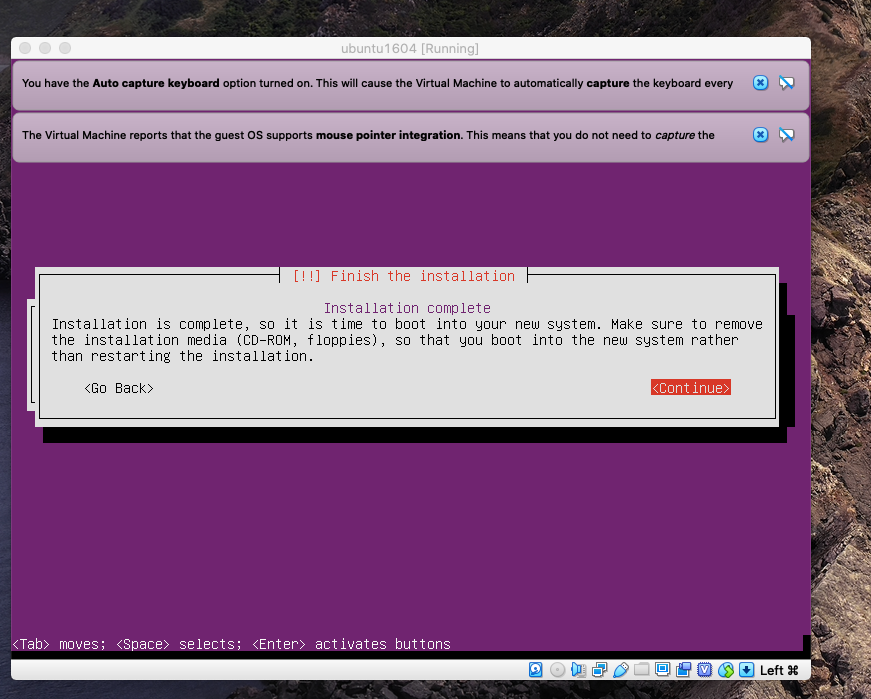
### Forward Port
- For VM, follow the below steps to use NAT network and forward required ports to host machine.
  - 22->2222 for ssh
  - 80->8080 for gitlab
  - 8081->8081 and 8082->8082 for go app
  - 31080->31080 and 31081->31081 for go app in k8s
- Go to VM VirtualBox Manager, click 'Settings' and then click 'Network'. Hit 'Advanced' and then hit 'Port Forwarding' button to open a new dialog.
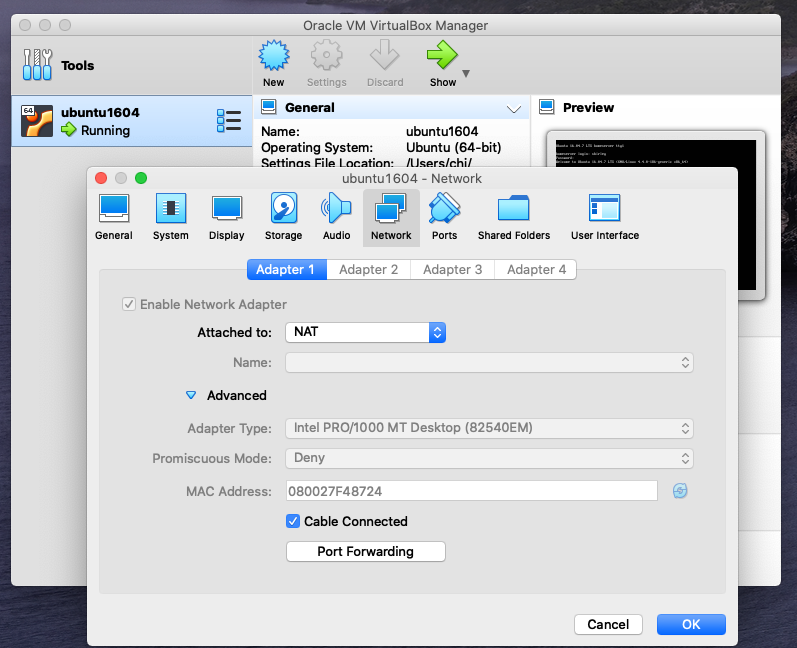
- In this dialog, click '+' button to add all rules for the above ports. And hit 'OK'. Please note, the 'Name' of each rule can't be duplicated.
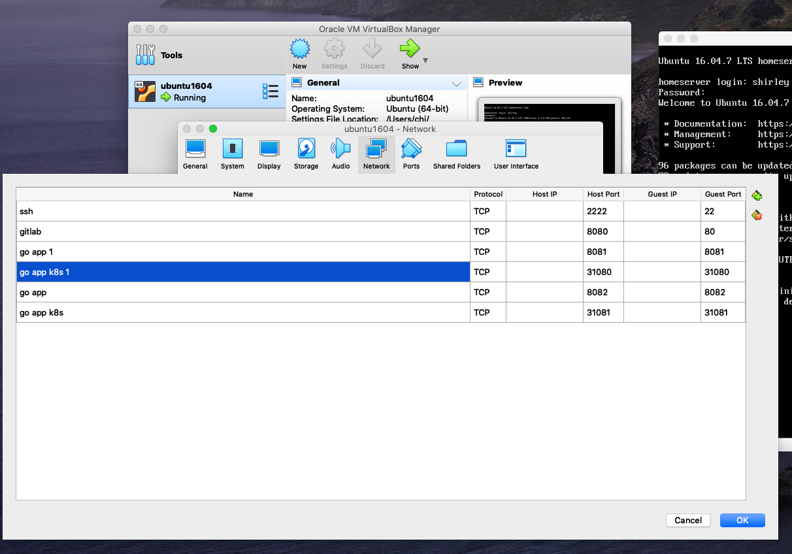
