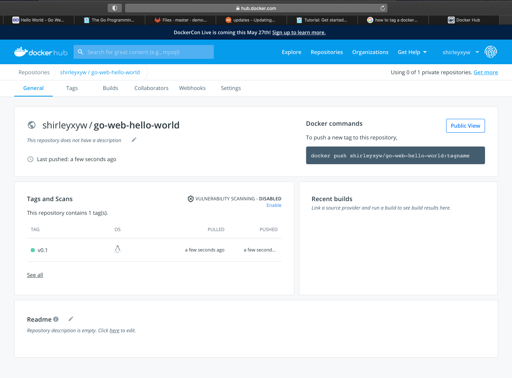

# Push Image to Dockerhub
This session will talk about how to push the image to Dockerhub. I will tag the docker image using your_dockerhub_id/go-web-hello-world:v0.1 and push it to docker hub (https://hub.docker.com/) as an example.
##  Prerequisite
Please make sure you have an account in Dockerhub
## Steps
- List all images I have and find out the image I would like to work on
```
$ sudo docker images
```
- Tag the image:
```
$ sudo docker tag 363ae4eedd05 shirleyxyw/go-web-hello-world:v0.1
```
- Check if the image is tagged:
```
$ sudo docker images
```
- Login to Docker
```
$ sudo docker login
```
- Push the image to docker
```
$ sudo docker push shirleyxyw/go-web-hello-world:v0.1
```
- Expect output: https://hub.docker.com/repository/docker/shirleyxyw/go-web-hello-world



