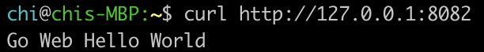

# Run the app in container
We have installed Docker successfully. So in this session, I will build a docker image for the web app and run that in a container, expose the service to 8082 as an example.
## Steps
### Build Docker Image and Run in a Container
- Enter the go-web-hello-world directory
- Created a Dockerfile
```
$ vi Dockerfile 
```
- Buid the app
```
$ sudo docker build -t helloworld .
```
- Run the image:
```
$ sudo docker run -p 8082:8082 47aadfb0fc4f
```
 - I got below error message:
 - docker: Error response from daemon: driver failed programming external connectivity on endpoint thirsty_feistel (4f907e895b97b1875c7e2e7e6716d042215bee1604463687b0ac1e68f14f157a): Error starting userland proxy: listen tcp4 0.0.0.0:8082: bind: address already in use.
ERRO[0000] error waiting for container: context canceled 
 - I debugged like below:
 - ``` $ sudo netstat -pna | grep 8082 ```
 - ``` tcp        0      0 127.0.0.1:8082          0.0.0.0:*               LISTEN      11761/sidekiq 5.2.9 ```
 - ``` tcp        0      0 127.0.0.1:8082          127.0.0.1:34488         ESTABLISHED 11761/sidekiq 5.2.9 ```
 - ``` tcp        0      0 127.0.0.1:34488         127.0.0.1:8082          ESTABLISHED 12345/prometheus ```
 - ``` $ sudo netstat -plten | grep 8082 ```
 - ``` tcp        0      0 127.0.0.1:8082          0.0.0.0:*               LISTEN      998        194175      17632/sidekiq 5.2.9 ```
 - Reason: 8082 is in use already
 - Solution: find out the process which binded to 8082, and kill that process.
 - ``` $ sudo kill -9 17632 ```
 - check if 8082 is still in use:
 - ``` $ sudo netstat -plten | grep 8082 ```
- Re-run docker image:
```
sudo docker run -p 8082:8082 363ae4eedd05
```
- You should able to see the result:


### Check in to Gitlab
```
$ git commit -m "dockerFile"
$ git push
```

