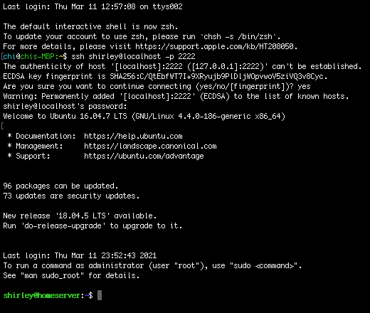
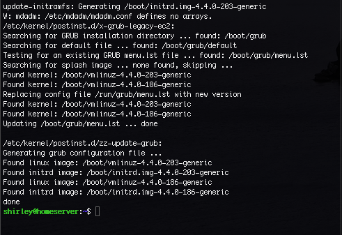
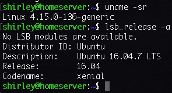

# Update System Packages and Linux Kernal
This session will introduce how to upgrade the system packages to the latest and then upgrade the kernal to the latest HWE kernal for 16.04.
## Steps
### ssh to Virtual Machine from Host Machine
- Use the below command to issue a ssh connect to your virtual machine.
```
$ ssh user@localhost -p 2222
```
and you should see something like below, it means the ssh is suucessful. I use my username 'Shirley' here as an example.
- 
## Upgrade the System Packages
- Use the below command to upgrade the system package index -to the latest.
```
$ sudo apt update
```
- Use the below command to upgrade packages.
```
$ sudo apt upgrade
```
- and you will see the below screen if the upgrade is suucessful.
- 
## Upgrade the Kernel to the Latest HWE Kernel for 16.04
- Please refer to [here](https://wiki.ubuntu.com/Kernel/LTSEnablementStack) and I find out the command to upgrade HWE kernal for 16.04 is:
```
$ sudo apt-get install --install-recommends linux-generic-hwe-16.04
```
- You can also refer to [here](https://wiki.ubuntu.com/Kernel/RollingLTSEnablementStack), you will find the latest HWE kernal for 16.04 is v4.15.
- run below command to check if the current kernal version is v4.15.
```
$ sudo reboot
```
```
$ uname -sr 
```
- Please note, you will still see the old kernal version here if you don't reboot the system first.
- You can see, my system is upgraded to v4.15 successful.
- 
